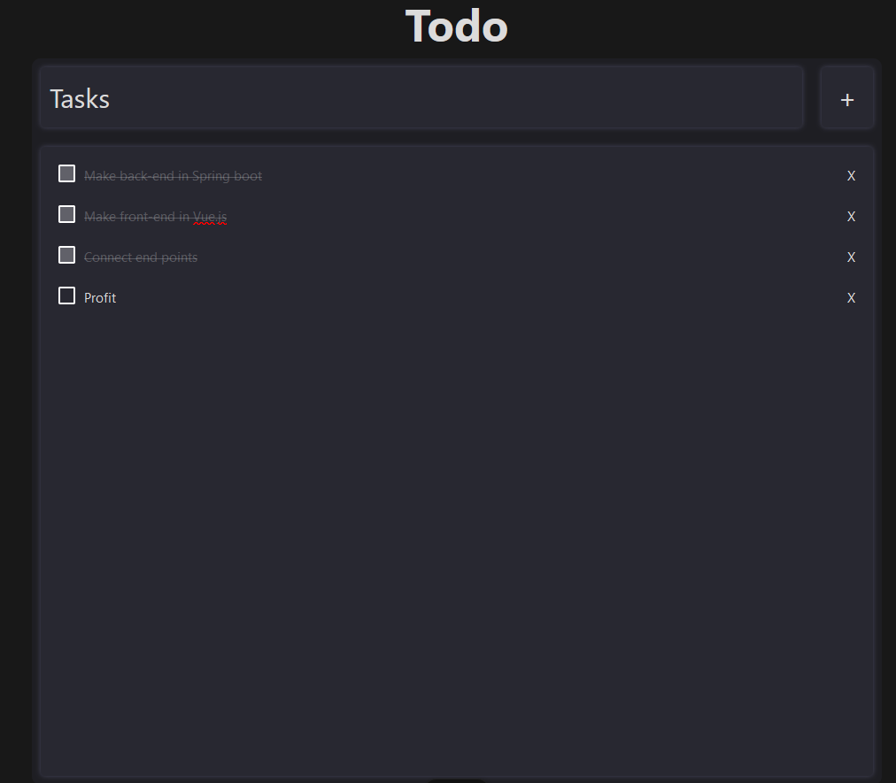

# ToDo App
![ ](https://github-readme-tech-stack.vercel.app/api/cards?title=+&lineCount=1&width=570&hideTitle=true&line1=data%3Aimage%2Fsvg%2Bxml%3Bbase64%2CiVBORw0KGgoAAAANSUhEUgAAACAAAAAcCAMAAAA3HE0QAAAABGdBTUEAALGPC%2FxhBQAAACBjSFJNAAB6JgAAgIQAAPoAAACA6AAAdTAAAOpgAAA6mAAAF3CculE8AAAA3lBMVEUAAABBuIM4amk5aWlBuIM%2Bu4NBuIM4eXA8e21BuINAuYVBt4M3X2Y3YWZBuYI8tIdBuIM6d206dm5BuINDvIZBt4Q2V2M3gIBAgGo1V2NCuYNAv4BBuIM4cGw4cWpBuIIzzJlCuYE1T2BAuIJAuYZBuIJBuINCuINAuINAuINBuYNCuINCuIJBuIJBuINBuIM9lHc0SV49lXc4Z2g0Sl80S184ZWc%2Fo3w%2BpHw5dW05dm0%2FroA1UGA0TmBAroA7hXE7hXJAtYI2WGM2WWM9lnc%2FpX05dmxAtoI2WWT%2F%2F%2F%2FxLd7ZAAAAL3RSTlMAt9PUuyn6Uk37LJLu7JER7IOE7hNu%2Bg4M%2BW0E1LGy1wVJ%2FrYoK9PWREi1kGy064FaUBoAAAABYktHREmHBeR8AAAAB3RJTUUH5wkBByUvNFR%2FtQAAAQ5JREFUKM99j2lbwjAQhFdQBA%2BKiKKgCHggh0oQFC9OOf7%2FL5KdZEvaps6HZnZm0ycv7bywuoqVICiJoYdil%2FZSMK%2Bc9fe5Tw%2FYvyHOHBAdwr33OT3ihWPsDhFnN7OXg%2F3Af0%2BI8jCfCE8LfOMM%2Fuub8%2FPixSWfPyOEJbypfIVhjJvXFRwTRDdV%2FeoapumMm3qdv%2FMpohoZ3WLsKV%2B%2FBlF0Z6FaiPf%2BgkFdDHRvIYoM6lJFEEU2agBRVH5AONkiNqqBBXpEulorNdOITQrJR9WIrXDvo0YRRVk0Q43YjvaC6kAUlbYLHVcvqA7EIKoLUdTS%2FVNcb1BdiAHUdnxP3nMcooXa%2Ba%2FfoMYhipphxD%2FZ9FFCzlDTFwAAACV0RVh0ZGF0ZTpjcmVhdGUAMjAyMy0wOS0wMVQwNzozNzo0NyswMDowMAJvjKoAAAAldEVYdGRhdGU6bW9kaWZ5ADIwMjMtMDktMDFUMDc6Mzc6NDcrMDA6MDBzMjQWAAAAAElFTkSuQmCC%2CVue.js%2C%3BSpringboot%2Cspringboot%2C6afd4d%3Bmysql%2Cmysql%2C35c3ff%3Btypescript%2Ctypescript%2C0096ff%3B)

A simple todo app I made to learn Springboot and Vue.js

## API calls
<b>api/v1/tasks</b>

- GET /
  - Returns all tasks stored in database as a list of objects
  - {id, name, done}
- GET /latestId
  - Obtains the next ID that will be assigned to a new task
- POST /newTask
  - Makes a new task with the name of "New Task"
- DELETE /{taskID}
  - Deletes a task based on the taskID
- PUT /updateTask
  - Updates a task based on JSON data in body
  - {id, newName}

## Running the app

<b>You'll need:</b>

1. JDK 8
2. Local MySQL Database
 

<b>Host location:</b>
 

- Client - localhost:8080
- Server - localhost:8081